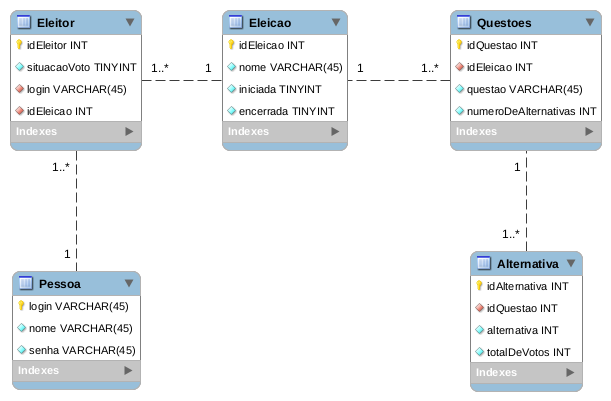

**Instituto Federal de Santa Catarina**

*Banco de Dados*

## Projeto Prático 1: Aplicação desktop com Java - Urna Eletrônica

Para a execução deste projeto, deve-se previamente produzir um arquivo `.txt` com logins da tabela Pessoa, ou utilizar o arquivo incluído neste projeto, denominado: `eleitores.txt`. Sendo necessário informar o caminho deste arquivo por linha de comando quando solicitado.

#### Funções Implementadas

- Criar uma eleição
- Abrir uma eleição
- Encerrar uma eleição
- Apurar uma eleição
- Ver resultados de uma eleição
- Criar questões para uma eleição
- Criar alternativas para uma questão
- Adicionar eleitores via arquivo de texto
- Suporte a voto Nulo
- Não permite que o mesmo eleitor vote duas vezes na mesma eleição
- Suporte a marcação de N respostas quando necessário

#### Funções Não Implementadas

- Não há tratamento para erros de digitação.

### Criar uma eleição

Ao criar uma eleição, será solicitado um título para a mesma. Em seguida, ela será criada. Os demais dados da tabela `Eleicao` são completados automaticamente:

A chave primária `idEleição` possui _auto increment_ e as colunas booleanas `iniciada` e `encerrada` são inciadas como Falso através da instrução sql presente na função `criarEleicao` da classe Urna.

### Criar uma questão

Ao criar uma questão, será questionado para qual eleição a mesma deverá pertencer, em seguida, será necessário informar um título para a mesma e por fim deverá ser dito quantas respostas a pergunta deverá reveber. Os demais da tabela `Questoes` dados são completados automaticamente:

A chave primária `idQuestao` possui _auto increment_ e as demais colunas são preenchidas com os dados fornecidos anteriormente.

### Criar uma alternativa

Ao criar uma alternativa, será questionado para qual eleição e questão a mesma deverá pertencer, em seguida, será necessário informar um título para a mesma. E por fim, ela será criada. Os demais da tabela `Alternativa` dados são completados automaticamente:

A chave primária `idAlternativa` possui _auto increment_ e a coluna `totalDeVotos` é iniciada com o valor `0` através da instrução sql presente na função `criarAlternativa` da classe Urna.

### Carregar eleitores

Caso haja uma eleição criada, então será questionada para qual a lista de eleitores será carregada. Em seguida, deve-se informar o caminho do arquivo `.txt` com os logins dos novos eleitores. E então serão carregados na tabela `Eleitores` atráves da instrução sql presente na função `carregarEleitores` da classe Urna.

## Diagrama de modelagem do banco

