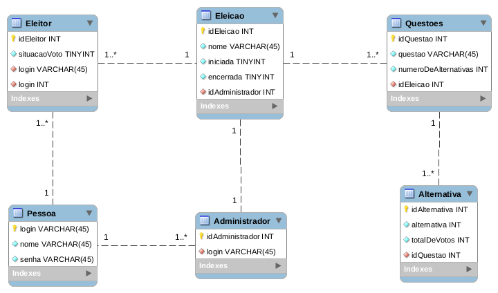

**Instituto Federal de Santa Catarina**

*Banco de Dados*

## Projeto Prático 2: Aplicação HTML e Bootstrap com Python - Urna Eletrônica

#### Funções Implementadas

- [x] Criar uma eleição
- [x] Abrir uma eleição
- [x] Encerrar uma eleição
- [x] Apurar uma eleição
- [x] Ver resultados de uma eleição
- [x] Criar questões para uma eleição
- [x] Criar alternativas para uma questão
- [x] Cadastrar eleitores
- [x] Cadastrar pessoas
- [x] Não permite que o mesmo eleitor vote duas vezes na mesma eleição
- [x] Suporte a marcação de N respostas

#### Funções Não-Implementadas

- [ ] Tratar votos considerado "nulos"

### Execução do projeto

Para a execução deste programa, primeiramente, deve-se efetuar o login na página principal. Aqui está uma lista de usuários com suas respectivas senhas e permissões:

|    LOGIN   	|   SENHA  	|   PERMISSÃO   	|
|:----------:	|:--------:	|:-------------:	|
| yan.m      	| 1234     	| Administrador / Eleitor	|
| amanda.s   	| 4321     	| Eleitor       	|
| pedro.w    	| 1998     	| Eleitor       	|
| fernanda.p 	| 3245     	| Sem permissão 	|
| sarom.t    	| sarom123 	| Eleitor       	|

Um **Administrador** pode criar, abrir, encerrar e apurar qualquer eleição na qual ele seja um administrador. Além de possuir permissão para cadastrar Pessoas e Eleitores.

Um **Eleitor** pode votar e ver resultados de eleições as quais o mesmo pertença.

As permissões de cada tipo de usuário estarão dispostas na barra de navegação no topo da página.
## Diagrama de modelagem do banco
